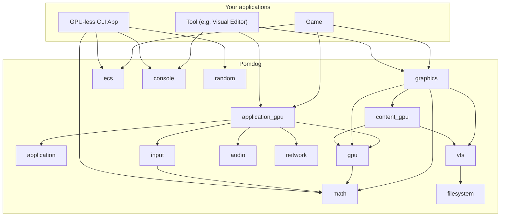

# Architecture

Pomdog is a small, experimental C++23 game engine for 2D and 3D games on Windows,
macOS, Linux, and the web. It provides rendering, window management, input, audio,
networking, and asset loading. It is a hobby project, available as source under
the MIT license. You can adapt its source to your game's needs.

Pomdog provides a modern graphics API with multiple backends: Direct3D, Metal,
OpenGL, Vulkan, and WebGL. Sprite, text, and effect rendering helpers sit alongside
GPU resource and command interfaces for custom rendering.

Development centers on source code and command-line tools. Go tools and Ninja
build shaders and asset archives before the game runs. You choose the game's
scene structure and can share its C++ logic with tools or simulations. Pomdog
tracks new compilers and language standards, so releases may break API compatibility.
Builds enable a broad set of compiler warnings and treat them as errors to catch
defects through compiler diagnostics.

## Features

Features outside the experimental directory:

- Multi-platform support (Windows, macOS, Linux, Emscripten/WebAssembly).
- Graphics API with multiple backends (Direct3D 11, OpenGL 4, Metal, Vulkan).
- Entity component system (ECS).
- TCP, UDP, TLS, and HTTP networking on native desktop backends; Browser implementations are currently stubs.
- Input support for keyboard, mouse, gamepad, and joystick.
- Audio engine (XAudio2 on Windows, OpenAL on Linux/macOS).
- Signals and slots.
- Math, random, filesystem, and virtual file system (VFS).
- Easing functions (`pomdog/math/easing.h`).
- PNG, DDS, and PNM image loading; WAV and Ogg Vorbis audio loading.
- Primitives, billboards, sprites, lines, and text batch rendering (`pomdog/graphics`).
- TrueType font rendering.

Experimental features:

- Promises, async/await.
- SVG texture loading.
- 2D and 3D particle systems.
- 2D skeletal animation (blend trees, skinned mesh).
- Post-process effects (FXAA, chromatic aberration, retro CRT, fish eye, sepia tone).
- Retained-mode GUI widgets (`experimental/gui`).
- MagicaVoxel importer/exporter.

Experimental features are optional libraries. Leave out the ones you do not need
to keep the engine smaller and lighter; the remaining libraries can be used on
their own, with their dependencies.

## Supported backends

| | Windows | macOS | Linux | Emscripten |
|:---|:---|:---|:---|:---|
| OS Version | Windows 11 and later | macOS 11.0 and later | Ubuntu 26.04 and later Arch Linux | Emscripten SDK (latest) |
| Window System | Win32 | Cocoa | X11 Wayland (planned) | HTML5 Canvas |
| Graphics API | Direct3D 11 OpenGL 4 Vulkan Direct3D 12 (WIP) | Metal OpenGL 4 Vulkan (planned) | OpenGL 4 Vulkan (planned) | WebGL 2 |
| Graphics Platform Layer | OpenGL: WGL + GLEW | OpenGL: NSOpenGL Vulkan: MoltenVK (planned) | OpenGL (X11): GLX + GLEW OpenGL (Wayland): EGL + GLEW (planned) | WebGL: Emscripten OpenGL |
| Audio | XAudio 2 | OpenAL | OpenAL | Web Audio (via Emscripten OpenAL) |
| Gamepad | DirectInput | IOKit (IOHIDManager) | Input Subsystem | Emscripten Gamepad API |
| Keyboard/Mouse | Raw Input / Win32 | Cocoa | X11 | Emscripten HTML5 Events |
| Network | WinSock2 | POSIX Socket | POSIX Socket | Emscripten Networking (WIP) |
| Compiler Toolchain | MSVC (Visual Studio 2026 / 2022) | Apple Clang (Xcode) | Clang GCC | emcc (Emscripten Compiler Frontend) |

## Libraries and dependencies

Pomdog consists of static libraries, each providing a group of engine features.
Choose the libraries your application needs and leave unused libraries out of
its link dependencies. In CMake, link them through aliases such as `pomdog::gpu`
and `pomdog::ecs`.

| Library | Responsibility |
|---|---|
| `base` | Basic types, clocks, logging, memory, signals, and shared utilities |
| `math` | Math types and operations |
| `random` | Random-number generators |
| `application` | Shared Game, GameHost, and GameSetup definitions; frame-rate limiting |
| `application_gpu` | Platform hosts, windows, event handling, and GPU startup |
| `gpu` | GPU resources, commands, and graphics API backends |
| `graphics` | Sprite, text, primitive, and effect rendering |
| `input` | Device input and state |
| `audio` | Audio devices and playback |
| `network` | Network services and transports |
| `filesystem` | OS file and directory access |
| `vfs` | Virtual paths, mounts, and archives |
| `content_gpu` | Shader and texture loading |
| `content_audio` | Audio loading and streaming decoders |
| `content_input` | Game-controller mapping loading |
| `content_utility` | Binary-reading helpers shared by content loaders |
| `ecs` | Entity component system |
| `console` | Console output |
| `experimental_async` | Async schedulers and tasks |
| `experimental_gltf` | glTF data and loading |
| `experimental_gui` | GUI widgets for tools and editors |
| `experimental_image` | CPU images and SVG loading |
| `experimental_image_effects` | Post-processing effects |
| `experimental_magicavoxel` | MagicaVoxel import and export |
| `experimental_particles` | Particle and beam systems |
| `experimental_skeletal2d` | 2D skeletal animation |
| `experimental_spine` | Spine data loading |
| `experimental_texture_atlas` | Static and dynamic texture atlases |

CMake links each library's dependencies automatically. Most engine libraries
depend on `pomdog::base`, directly or through another library. For example,
`pomdog::graphics` provides sprite and font rendering and depends on
`pomdog::gpu` for low-level graphics and `pomdog::math` for vector mathematics,
among other libraries.

The diagram illustrates library choices for a playable game, a tool such as a
VFX particle editor, and a GPU-free simulator run from the command line or CI.
Each application needs a different set of engine libraries. Arrows point from a
consumer to a dependency; `base`, experimental libraries, and some dependency
edges are omitted to keep the diagram readable.

For a game, use libraries such as `pomdog::application_gpu` for its host and
window and `pomdog::vfs` for assets. See
[examples/quickstart](../examples/quickstart/CMakeLists.txt) for a working game
configuration. A CLI simulator that owns its update loop can use just
`pomdog::math` and its `pomdog::base` dependency, adding other libraries as
needed. It can omit `application_gpu`, `gpu`, and `graphics` when it does not
render. For offscreen rendering with a GPU, see [Headless Mode](headless-mode.md).

See [Using Pomdog with CMake](using-pomdog-with-cmake.md) for library selection
and projects with multiple applications, and
[CMake Build Settings](cmake-build-settings.md) for library definitions and
compiler policies.

## Dependencies

### Tooling

| Tool | Purpose |
|---|---|
| Go | Build the asset conversion, bootstrap, and development tools |
| CMake | Configure C++ builds and library dependencies |
| Ninja | Run incremental and parallel asset builds; also build C++ targets with CMake's Ninja generator |
| Slang (`slangc`) | Compile Slang shaders to SPIR-V |
| spirv-cross | Convert SPIR-V to GLSL, HLSL, and Metal shading language for the graphics backends |

### Compile-time and runtime dependencies

Library names below refer to the engine libraries that use each dependency
directly. Nano SVG and RapidJSON are included as source or headers; they do not
have separate link targets.

| Dependency | Purpose and engine use |
|---|---|
| zlib | Compression support required by libpng |
| libpng | PNG image decoding in `content_gpu` |
| GLEW | OpenGL function loading in `gpu` on Linux and Windows |
| Mbed TLS | TLS connections in `network` on Windows, macOS, and Linux |
| Nano SVG | SVG parsing and rasterization in `experimental_image` |
| RapidJSON | JSON loading in `experimental_gltf`, `experimental_particles`, and `experimental_spine` |
| stb | TrueType font rasterization in `graphics` and Ogg Vorbis decoding in `content_audio` |
| UTF8-CPP | UTF-8 validation and conversion |
| FlatBuffers | Access to binary asset data, including archive indexes, controller mappings, and shader reflection |
| fmt | String formatting |

### Assets included in shipping builds

The asset pipeline packages the following data with the application for use at
runtime. See [Asset Pipeline and Runtime](asset-pipeline-and-runtime.md) for
asset conversion and packaging.

| Dependency | Purpose |
|---|---|
| SDL_GameControllerDB | Game-controller mappings converted by [generate-game-controller-db](../tools/cmd/generate-game-controller-db/README.md) into a FlatBuffers asset and packed into the asset archive for runtime loading |

### Unit test dependencies

| Dependency | Purpose |
|---|---|
| doctest | C++ unit test framework |

For a complete list with licenses, see [Open Source Software Used in Pomdog](open-source-software-used-in-pomdog.md).
