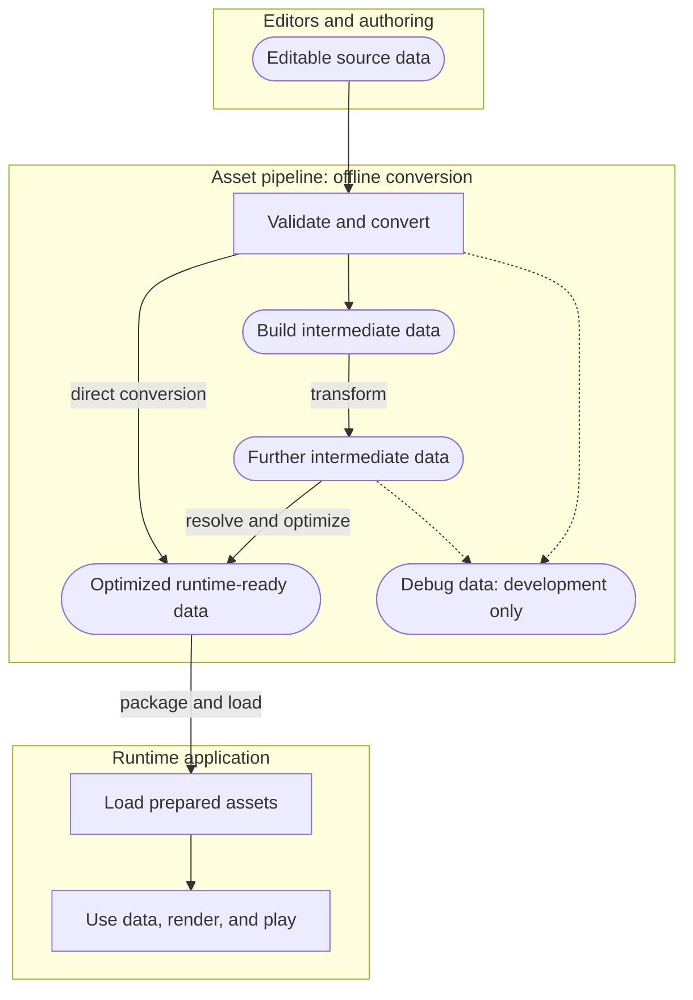

# Asset Pipeline and Runtime

Pomdog favors doing work offline whenever it can be resolved before the game
runs. Asset tools validate, convert, and organize data into forms the runtime can
load and use with little setup. This keeps asset preparation out of the game loop
and reduces startup work, runtime complexity, and opportunities for bugs.

Moving that work offline can improve loading and frame times and reduce power
consumption. It also makes asset errors visible during the build, close to the
edit that caused them. Finding invalid references, malformed data, or incompatible
shader interfaces before launching the game helps iteration and game stability.

For shipping a finished game (creating a distributable package), see [Shipping](shipping.md).

## Overview

The pipeline separates editing, offline conversion, and runtime use. An asset
may convert directly to its runtime format or pass through several intermediate
formats. Converters can also emit debug information for development tools.



Dashed arrows show optional debug outputs for developer inspection. Editable source,
intermediate files, and debug data stay out of the product package. Only prepared
runtime assets cross into the shipped application. The diagram describes the
design direction; some existing loaders still convert source formats at runtime,
as described below.

## Data roles

Choose a format for the job the data serves. Editing convenience and runtime
access patterns usually call for different representations.

| Data | Purpose | Examples | Shipped with the game |
|---|---|---|---|
| Editable source data | Authoritative inputs maintained by people and editors | TOML parameters, source images, audio, shader source | No |
| Build intermediate data | Outputs consumed by later conversion steps; can be regenerated | SPIR-V before cross-compilation, normalized tables, resolved references | No |
| Debug data | Explain optimized output during development | Hash-to-name dictionaries, readable indexes, conversion reports | No |
| Runtime-ready data | Optimized output loaded by the application | FlatBuffers tables, backend shaders, converted media, asset archives | Yes |

Editable data and runtime data need not use the same file boundaries. Authors can
split a table across small files; a converter can combine them into one runtime
buffer. Keep readable names and reverse-lookup dictionaries in separate debug
outputs when the runtime needs only numeric keys. Pomdog's `content.idx-debug`
is one example of a non-shipping debug output.

The source assets, schemas, conversion tools, and recipes should be sufficient to
regenerate the outputs. Make conversion deterministic: define output ordering,
resolve references, and detect duplicate keys or hash collisions during the build.
Sort lookup tables by their lookup key, but preserve authored order when it carries
meaning, such as draw order or credits. Do not serialize a Go map in iteration order.

## Why Go tools

Most of the offline tools are written in Go. Its standard tooling provides
formatting, package management, module dependency resolution, and cross-compilation.
This reduces decisions about how to structure, build, and distribute each small
tool. Standalone executables are convenient to share without asking each developer
to install a language runtime or recreate a dependency environment.

Pomdog favors portable tools so developers can build assets on Windows, macOS,
and Linux. Go tools coordinate specialized programs such as shader compilers and
media converters where needed; those programs still have their own platform
requirements. See [Shader Compilation](shader-compilation.md) for the shader tools.

## Prepare data for runtime access

Resolve as much as possible during conversion: compute lookup hashes, replace
asset references with indices where appropriate, and sort searchable tables.
For example, an offline-sorted array of hash keys lets the runtime find an entry
with binary search over the loaded data. It need not copy the entries into STL
containers, sort them at startup, or construct a hash map for that lookup.

FlatBuffers fits this approach because its generated accessors read fields and
vectors from the loaded byte buffer. They do not require deserializing the data
into a separate object graph. Keep the buffer alive while using those accessors,
and validate it before access. Pomdog's archive index uses this layout: the build
stores sorted keys, and VFS searches them to locate bytes in the pack file.

File I/O, buffer verification, required decoding, GPU uploads, and playback still
happen at runtime. The goal is to avoid repeating preparation whose result could
have been stored in the asset.

Older experimental loaders still parse JSON and third-party authoring formats at
runtime. The intended direction is to replace those paths with offline conversion
and optimized runtime data, leaving the runtime to load and play the result.
The loader examples later in this document describe the existing APIs, including
these remaining migration cases.

## Ninja and iteration

Ninja provides parallel execution, incremental builds, and fast no-op builds.
That makes it practical to invoke the asset build after each edit. These benefits
depend on accurate dependencies: when adding a converter, declare its input and
output files, including included source files and secondary debug outputs.
Track changes to schemas, converter binaries, and conversion options as well.
Use explicit dependencies or depfiles for inputs discovered during conversion.
Missing a dependency can leave stale runtime data even though the build succeeds.

The sections below describe the example applications' build scripts, output
layout, and runtime loading APIs. For packaging the results, see [Shipping](shipping.md).

## Running the Asset Build

Before building assets, bootstrap the pipeline tools:

```sh
./tools/script/bootstrap.sh
```

This compiles the Go-based tools and downloads external binaries (e.g. `slangc`, `spirv-cross`, `ninja`) into `build/tools/`.

Then build all assets for every example application:

```sh
./tools/script/assetbuild.sh
```

Asset output is written to `build/<app>/` for each application listed in the script (`quickstart`, `pong`, `feature_showcase`).

> **Note:** `assetbuild.sh` is written for the built-in example applications. For your own application, use it as a reference and write a similar script that calls the same tools.

## How It Works

For each application, `assetbuild.sh` generates Ninja files for shaders, copying,
conversion, and archiving. `subninja-gen` includes them in one top-level
`build.ninja`, then the script invokes Ninja once for that application.
Ninja can schedule independent work across those stages in parallel while
respecting dependencies between them. The combined build also shares incremental
state: an edit rebuilds the affected outputs and their dependents, and a no-op
build returns without rerunning converters. Keeping the stages in one build graph
lets them share Ninja's scheduling and dependency tracking across file boundaries.

The individual build stages are:

1. **Shader build (engine)**: `shader-ninja-gen` generates a Ninja file that compiles engine shaders from `assets/shaders/shaderbuild.toml`.
2. **Shader build (app)**: Same tool, for the application's own shaders in `examples/<app>/assets/shaders/shaderbuild.toml`.
3. **Asset copy (engine)**: `copy-ninja-gen` generates a Ninja file that copies engine assets (fonts, etc.) into the content directory.
4. **Asset copy (app)**: Same tool, for the application's own assets (textures, models, etc.).
5. **Asset conversion (engine and app)**: `asset-convert-ninja-gen` generates conversion rules from each `assetconvert.toml`, including audio preprocessing.
6. **Archive**: `archive-ninja-gen` generates a Ninja file that packs everything into `content.idx` + `content.pak`, producing separate archives for each platform (windows, macos, linux, web).
7. **Combined build**: `subninja-gen` aggregates all the above Ninja files using Ninja's `subninja` feature.

Each stage can also be run independently by invoking `ninja` on the individual `.ninja` file.

### Cleaning

To clean built assets, either run `ninja -t clean` in the build directory, or delete the application's build folder (e.g. `build/feature_showcase`).

## Build Output Directory Structure

Each application's asset build produces the following directory layout under `build/<app>/`:

```
build/<app>/
├── shaderbuild/          # Shader compilation intermediates
│   ├── shaders_pomdog.ninja
│   └── shaders_app.ninja
├── copybuild/            # Asset copy build files
│   ├── copy_pomdog.ninja
│   └── copy_app.ninja
├── content/              # Converted assets (pre-archive)
│   ├── shaders/
│   │   ├── glsl/
│   │   ├── webgl/
│   │   ├── d3d11/
│   │   ├── metal/
│   │   ├── vk/
│   │   └── reflect/
│   ├── fonts/
│   ├── textures/
│   └── ...
├── archive/
│   └── build/            # Auto-generated archive recipes
├── archivebuild/
│   ├── build.ninja
│   ├── windows/
│   │   └── content.idx-debug
│   ├── macos/
│   │   └── content.idx-debug
│   ├── linux/
│   │   └── content.idx-debug
│   └── web/
│       └── content.idx-debug
├── shipping/
│   ├── windows/          # Windows platform archive
│   │   ├── content.idx
│   │   └── content.pak
│   ├── macos/            # macOS platform archive
│   │   ├── content.idx
│   │   └── content.pak
│   ├── linux/            # Linux platform archive
│   │   ├── content.idx
│   │   └── content.pak
│   └── web/              # WebGL / Emscripten archive
│       ├── content.idx
│       └── content.pak
└── build.ninja           # Top-level combined build file
```

- **`content/`** contains converted assets before archiving. During development, this directory can be mounted as a VFS overlay so you can edit individual files without rebuilding the archive (see [Virtual File System](#virtual-file-system-vfs)).
- **`shipping/windows/`**, **`shipping/macos/`**, **`shipping/linux/`**, and **`shipping/web/`** contain the archived assets for each platform. Platform-specific packaging scripts further assemble these into distributable packages (see [Shipping](shipping.md)).
- **`archivebuild/`** contains debug index files (`content.idx-debug`) that map human-readable paths to their hash keys. These are not included in shipping output.

## Shader Compilation

All shaders are written in [Slang](https://github.com/shader-slang/slang) (`.slang` files) and compiled to SPIR-V, then cross-compiled to every target backend (GLSL, HLSL, Metal, SPIR-V) via `spirv-cross`. The `shader-ninja-gen` tool reads a `shaderbuild.toml` recipe and generates a Ninja build file that orchestrates the full pipeline.

For details on the shader compilation toolchain, SPIR-V post-processing, known pitfalls, and the GLSL → Slang conversion reference, see [Shader Compilation](shader-compilation.md).

## Archive System

### File Layout

The archive system produces two companion files:

| File | Description |
|------|-------------|
| `content.idx` | FlatBuffers index: sorted array of xxHash-64 keys mapping to file offsets |
| `content.pak` | Binary blob: concatenated raw file data |
| `content.idx-debug` | Debug-only: maps human-readable paths to their hash keys |

### FlatBuffers Schema (`schemas/archive.fbs`)

```flatbuffers
table ArchiveEntry {
    start_offset : uint32;       // Byte offset into the .pak file
    uncompressed_size : uint32;
    compressed_size : uint32;
    compressed : bool;           // Reserved for future lz4/zstd compression
}

table ArchiveKey {
    key : uint64(key);           // xxHash-64 of the virtual file path
    index : uint32;              // Index into the entries array
}

table Archive {
    keys : [ArchiveKey];         // Sorted for O(log n) binary search
    entries : [ArchiveEntry];
}
```

### Hashing

All path-to-key lookups use xxHash with a fixed seed:

```go
// tools/pkg/stringhash/string_hash.go
const Seed32 = uint32(20160723)   // xxHash-32 for shader reflection names
const Seed64 = uint64(20160723)   // xxHash-64 for archive file keys
```

### Archive Recipe

The `archive-content` tool accepts one or more TOML recipe files that list which files to include. Recipes can optionally target specific platforms:

```toml
# assets/archive/archive_fonts.toml
[[group]]
paths = [
    "fonts/NotoEmoji-Medium.ttf",
    "fonts/Roboto-Medium.ttf",
    "fonts/UbuntuMono-Bold.ttf",
]
```

```toml
# Generated by shader-archive-gen
[[group]]
target_platforms = ["windows", "linux", "macos"]
paths = [
    "shaders/glsl/basic_effect_vs.glsl",
    "shaders/glsl/basic_effect_ps.glsl",
]

[[group]]
target_platforms = ["emscripten"]
paths = [
    "shaders/webgl/basic_effect_vs.glsl",
    "shaders/webgl/basic_effect_ps.glsl",
]
```

When `--platform` is passed to `archive-content`, groups whose `target_platforms` do not include that platform are skipped, producing a platform-specific archive.

The `shader-archive-gen` tool can automatically generate archive recipes from `shaderbuild.toml`, listing all compiled shader outputs for each platform. This avoids manually maintaining archive recipes for large numbers of shader files.

## Virtual File System (VFS)

### Overview

The VFS API (`pomdog/vfs/`) lets asset loaders use the same virtual paths during
development, with loose files on disk, and in shipping builds, with packed
archives. The loading code can keep asking for `/assets/textures/player.png`
while the application chooses where that data comes from.

An overlay lets a loose file take priority over the matching archive entry. During
development, you can rebuild a texture into the overlay directory and load it
without repacking the archive. Files absent from the overlay still come from the
base archive.

A game with mod support can use the same mechanism for assets loaded by virtual
path: mount a mod directory over the shipped archive, and matching mod files take
priority when the game reads them. This changes which data the runtime sees while
leaving the product's archive files untouched. The game chooses which mods to
mount and how to reload assets it has already loaded.

### API

The application creates the VFS context and mounts its volumes before loading
assets. GameHost does not own the context or mount volumes.

```cpp
#include "pomdog/vfs/file_archive.h"
#include "pomdog/vfs/file_system.h"

// Create a VFS context
auto [fs, err] = vfs::create();

// Mount the base archive first. Prefer mmap where supported; use file I/O otherwise.
auto [vol, volErr] = vfs::openArchiveFile("content.idx", "content.pak", vfs::ArchiveIOMethod::PreferMmap);
auto mountErr = vfs::mount(fs, "/assets", std::move(vol), {.readOnly = true, .hashKeyLookup = true});

// Optionally overlay loose files at the same mount point.
auto overlayErr = vfs::mount(fs, "/assets", physicalPath, {.readOnly = true, .overlayFS = true});

// Open and read a file
auto [file, openErr] = vfs::open(fs, "/assets/textures/pomdog.png");
auto [info, statErr] = file->stat();
std::vector<uint8_t> buffer(info.size);
auto [bytesRead, readErr] = file->read(std::span<uint8_t>(buffer));
```

The snippet omits error handling for brevity. Check each returned error before using the context, volume, or file. `PreferMmap` falls back to standard I/O on platforms without mmap support; an actual open error must still be handled.

### Mount Strategy

Applications typically configure VFS as follows:

1. **Archive mount**: Mount the packed archive at `/assets` with `hashKeyLookup = true`. This uses the sorted xxHash-64 key table in the `.idx` file for O(log n) lookup. The two-argument `openArchiveFile()` uses standard file I/O. The `PreferMmap` overload selects memory mapping on supported desktop platforms.
2. **Overlay mount**: Optionally mount a loose-file directory at the same `/assets` path with `overlayFS = true`. When overlay is enabled, loose files take priority over archive entries. This allows developers to iterate on individual assets without rebuilding the archive.

> **Note:** Memory mapping changes how the archive is accessed internally. The
> public `File::read()` API still copies data into the caller's buffer.

The optional `pomdog::setupDefaultVFS()` helper in
`pomdog/vfs/default_vfs_setup.h` uses standard file I/O, requires the archive, and
adds a loose-file overlay when `assetsDir` is set. In a game application, call it
in `GameSetup::configure()` and transfer the context to the game before GameSetup
is destroyed.

VFS and this helper can also be used in a headless asset checker, a simulation,
or a CLI tool. Link `pomdog::vfs` and create the context from your own startup
code; no GameHost, window, or GPU is required. For layouts the helper does not
cover, such as loading only loose files, use `vfs::create()` and `vfs::mount()`
directly. See [Using Pomdog with CMake](using-pomdog-with-cmake.md) for library selection.

### Hash-Based Lookup

When `hashKeyLookup` is enabled, the VFS can look up files by their xxHash-64 key pair (mount volume hash + file path hash) instead of string comparison. This is the fast path used in shipping builds.

### Loader Functions

All loader functions accept a `std::shared_ptr<vfs::FileSystemContext>` as their first parameter:

```cpp
// Textures
auto [tex, err] = loadTexture2D(fs, graphicsDevice, "/assets/textures/pomdog.png");

// Shaders
auto [shader, err] = loadShaderAutomagically(fs, graphicsDevice, ...);

// Fonts
auto [font, err] = loadTrueTypeFont(fs, "/assets/fonts/NotoSans-Regular.ttf");

// Models
auto [glb, err] = GLTF::Open(fs, "/assets/glb/f15.glb");
auto [vox, err] = loadVoxModel(fs, "/assets/voxel_models/maidchan.vox");

// Spine skeletal data
auto [atlas, err] = createTextureAtlas(fs, graphicsDevice,
    "/assets/skeletal2d/skeleton.tileset",
    "/assets/skeletal2d/skeleton.png");
auto [desc, err]  = spine::loadSkeletonDesc(fs, "/assets/skeletal2d/skeleton.json");

// SVG images
auto [tex, err] = loadTextureFromSVGFile(fs, graphicsDevice, "/assets/svg/icon.svg", 24, 24);

// Audio
auto [audio, err] = loadAudioClip(fs, audioEngine, "/assets/sounds/pong1.wav");

// Particles
auto [clip, err] = loadParticleClip(fs, "/assets/particles/fire2d.json");
```

## Build Tools Reference

All build tools are Go programs in `tools/cmd/`:

| Tool | Purpose |
|------|---------|
| `shader-ninja-gen` | Generates Ninja build files from `shaderbuild.toml` |
| `shader-archive-gen` | Converts `shaderbuild.toml` into archive recipe TOML |
| `spirv-rename-blocks` | Strips `_std140` suffix from UBO type names in SPIR-V |
| `spirv-patch-interface` | Restores dead-code eliminated PS input variables in SPIR-V |
| `spirv-strip-debug` | Strips debug and non-semantic instructions from SPIR-V |
| `spirv-shader-reflect` | Extracts reflection data (bindings) from SPIR-V |
| `glsl-rename-combined-samplers` | Rewrites `SPIRV_Cross_Combined*` sampler names back to original texture names |
| `spirv-link-validate` | Validates VS/PS interface compatibility |
| `archive-content` | Packs files into `.idx` + `.pak` archives |
| `archive-inspect` | Dumps archive contents for debugging |
| `bootstrap-toolchain` | Downloads and sets up the build toolchain |
| `glsl-minifier` | Minifies GLSL source for shipping |

Shared packages live in `tools/pkg/`:

| Package | Purpose |
|---------|---------|
| `archives` | Archive recipe parsing and generation |
| `ninja` | Ninja build file writer |
| `stringhash` | xxHash-32/64 with fixed seeds |
| `spirvreflect` | SPIR-V reflection data structures |
| `spvparse` | SPIR-V binary parser |
| `depfile` | Makefile-style dependency file parser |
