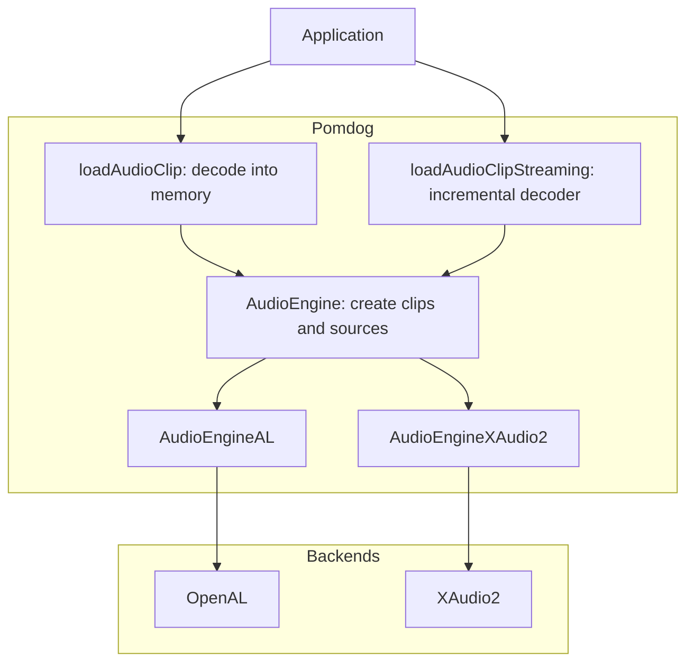
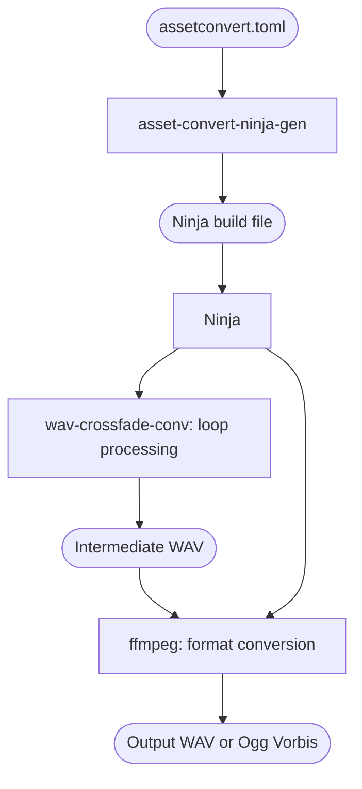

# Audio

Pomdog supports in-memory and streaming audio playback through two backends: **OpenAL** (Linux, macOS, Emscripten) and **XAudio2** (Windows).

## Architecture



### Key classes

| Class | Header | Purpose |
|-------|--------|---------|
| `AudioEngine` | `pomdog/audio/audio_engine.h` | Abstract factory for clips and sources |
| `AudioClip` | `pomdog/audio/audio_clip.h` | Decoded or streaming audio data |
| `AudioSource` | `pomdog/audio/audio_source.h` | Playback handle with play/pause/stop/volume |
| `AudioChannels` | `pomdog/audio/audio_channels.h` | Mono / Stereo enum |

## Supported formats

| Format | Extension | Non-streaming | Streaming |
|--------|-----------|---------------|-----------|
| WAV (PCM) | `.wav` | Yes | Yes |
| Ogg Vorbis | `.ogg` | Yes | Yes |

## Loading audio

Link `pomdog::content_audio` for the loaders and `pomdog::audio` for playback APIs.
Check the returned error before using a clip or source.

Both loaders live in `pomdog/content/audio_clip_loader.h` and take a VFS file system context, an audio engine, and a virtual file path.

### Non-streaming (in-memory)

```cpp
auto [clip, err] = loadAudioClip(fs, audioEngine, "/assets/sounds/effect.wav");
```

The loader reads and decodes the file into an `AudioClip` containing PCM samples. Use this mode for small, frequently played sound effects.

### Streaming

```cpp
auto [clip, err] = loadAudioClipStreaming(fs, audioEngine, "/assets/sounds/music.ogg");
```

Reads only the first 12 bytes to detect the format, then passes the open file handle to a streaming decoder (`openAudioClipFileWAV` or `openAudioClipFileOggVorbis`). Audio data is decoded incrementally during playback. Use streaming for music tracks and long ambient sounds.

## Playback

```cpp
// Create a source (second argument = looped)
auto [source, err] = audioEngine->createAudioSource(clip, true);

source->play();
source->pause();
source->stop();
source->setVolume(0.5f);  // 0.0 = silent, 1.0 = full

// Main volume affects all sources
audioEngine->setMainVolume(0.8f);
```

### AudioSource lifecycle

An `AudioSource` remains available for reuse after playback finishes. `play()` starts or resumes playback; it is not a seek-to-start operation. There is no completion callback; poll the source state if you need to detect when playback ends.

### Simultaneous sources

Pomdog does not impose its own limit on the number of simultaneous `AudioSource` instances. The practical limit depends on the platform backend (e.g. OpenAL's default source count, XAudio2's voice pool).

## Threading model

| Backend | Streaming decode thread |
|---------|------------------------|
| XAudio2 (Windows) | Dedicated audio thread |
| OpenAL (Linux, macOS) | Host loop calls `AudioEngineAL::update()`; Pomdog does not create a streaming decoder thread in this backend |
| OpenAL (Emscripten) | Host loop calls `AudioEngineAL::update()` |

Non-streaming data is decoded at load time. This does not make the playback API generally thread-safe; use the owning host / audio context appropriately.

## Streaming details

### Buffer configuration

Streaming buffer sizes are currently fixed and not user-configurable:

| Backend | Buffer size | Buffer count | Strategy |
|---------|-------------|--------------|----------|
| OpenAL | 4 KiB decode buffer | 4 queued buffers | Queue polling via `alSourceQueueBuffers` |
| XAudio2 | 4 KiB per buffer | 3 | Background polling of `IXAudio2SourceVoice` state |

### Error handling

If a streaming decode error occurs during playback, the error is currently silenced and the affected buffer fill is skipped. The API does not report this error to the caller.

## Offline asset pipeline

For shipping, raw audio assets are pre-processed using Go tools and ffmpeg. The pipeline is driven by a TOML recipe and Ninja build files.

### Pipeline overview



### Tools

| Tool | Location | Purpose |
|------|----------|---------|
| `asset-convert-ninja-gen` | `tools/cmd/asset-convert-ninja-gen/` | Generates Ninja build rules from a TOML recipe |
| `wav-crossfade-conv` | `tools/cmd/wav-crossfade-conv/` | Applies crossfade blending for seamless loop points |
| `ffmpeg` | `build/tools/ffmpeg` | Resamples, converts channels, and encodes to WAV or Ogg Vorbis |

### Recipe format (`assetconvert.toml`)

```toml
# Simple WAV conversion (resample, no loop)
[[sound_clip]]
in_file = "sounds/ambient.wav"
out_file = "sounds/ambient_oneshot.wav"
in_format = "wav"
out_format = "wav"
wav_options = {channels = 2, sample_rate = 22050, bit_depth = 16}

# WAV with crossfade loop
[[sound_clip]]
in_file = "sounds/ambient.wav"
out_file = "sounds/ambient_loop.wav"
in_format = "wav"
out_format = "wav"
wav_options = {channels = 1, sample_rate = 44100, bit_depth = 16}
loop = {trim_start = true, seconds = 2.0, align_samples = 4096}

# WAV → Ogg Vorbis with crossfade loop
[[sound_clip]]
in_file = "sounds/ambient.wav"
out_file = "sounds/ambient_loop.ogg"
in_format = "wav"
out_format = "vorbis"
vorbis_options = {channels = 1, sample_rate = 44100, bit_rate = 128}
loop = {trim_start = true, seconds = 2.0, align_samples = 4096, fade_method = "equal_power"}
```

### Crossfade methods

The `fade_method` field in the `loop` table selects the crossfade curve used by `wav-crossfade-conv`:

| Method | Formula | Description |
|--------|---------|-------------|
| `equal_power` (default) | `sin(t·π/2)` / `cos(t·π/2)` | Constant perceived loudness: recommended for most audio |
| `linear` | `t` / `1−t` | Simple interpolation; may dip at midpoint |
| `logarithmic` | `log₁₀(1+9t)` / `log₁₀(1+9(1−t))` | Approximates dB-scale curve |

### Running the pipeline

```sh
# 1. Build the tools
(cd tools/cmd/asset-convert-ninja-gen && go build -o ../../../build/tools/asset-convert-ninja-gen)
(cd tools/cmd/wav-crossfade-conv && go build -o ../../../build/tools/wav-crossfade-conv)

# 2. Generate the Ninja file
./build/tools/asset-convert-ninja-gen \
    -recipe ./examples/feature_showcase/assets/assetconvert.toml \
    -indir ./examples/feature_showcase/assets \
    -outninja ./build/feature_showcase/convertbuild/audio.ninja \
    -outdir ./build/feature_showcase/content \
    -intdir ./build/feature_showcase/int \
    -tooldir ./build/tools

# 3. Run the conversion
./build/tools/ninja -f ./build/feature_showcase/convertbuild/audio.ninja
```

## Platform notes

### Windows (XAudio2)

- Uses XAudio2 for low-latency playback
- Streaming decoding runs on a dedicated audio thread
- Currently uses the default audio device; device enumeration is not yet implemented

### Linux / macOS (OpenAL)

- Uses OpenAL for cross-platform audio
- Pomdog streaming decoding is polled by the host through `AudioEngineAL::update()`

### Emscripten (OpenAL)

- OpenAL is provided by the browser's Web Audio API bridge
- Streaming decoding is polled by the host through `AudioEngineAL::update()`
