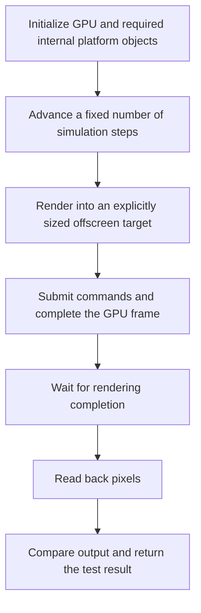

# Headless Mode

> **Note:** The headless-mode implementation is still being evaluated. Its API
> and behavior may change as this work continues.

## Headless behavior

`GameHostOptions::headless` requests a hidden window with input devices disabled.
The host still creates a GPU device and requires GPU libraries.
The implementation differs by platform; setting this flag alone does not provide
a portable offscreen-rendering test harness.

| Platform | Current behavior |
|---|---|
| Windows | The bootstrap hides the created window with `ShowWindow(SW_HIDE)`. The host skips keyboard, mouse, and gamepad initialization. GPU creation still occurs. The window is shown during creation before the bootstrap hides it, so a transient visible window is possible. |
| Linux / X11 | The host skips keyboard, mouse, and gamepad initialization, but window creation still calls `XMapWindow`. The flag does not currently provide a hidden-window path. X11 / GLX remains required. |
| macOS | The hosts skip keyboard, mouse, and gamepad initialization, but the bootstrap still shows the window. Rendering also has visibility checks; GPU headless needs additional work. |
| Emscripten | The host creates its canvas, GPU, audio, and input devices unconditionally. It does not currently implement the headless / subsystem-toggle behavior of the desktop hosts. |

Implementation references: [Win32 bootstrap](../pomdog/application/win32/bootstrap_win32.cpp),
[X11 window](../pomdog/application/x11/game_window_x11.cpp),
[Cocoa bootstrap](../pomdog/application/cocoa/bootstrap_cocoa.mm),
and [Emscripten host](../pomdog/application/emscripten/game_host_emscripten.cpp).

## Runtime options

Configure these in `GameSetup::configure()` before the host is initialized.
These are runtime initialization choices, not CMake library-selection options.

| Field | Default | Desktop behavior |
|---|---|---|
| `headless` | `false` | Skips input initialization; window visibility behavior is platform-dependent as described above |
| `enableAudio` | `true` | Whether to create the audio engine |
| `enableGamepad` | `true` | Whether to create gamepad services; also skipped when headless |
| `enableNetwork` | `true` | Whether to create IOService and HTTPClient |
| `gameControllerDB` | `nullptr` | Optional gamepad mapping data prepared by the application |

For example, this configuration requests the existing Windows headless behavior:

```cpp
std::unique_ptr<pomdog::Error>
GameSetupImpl::configure(
    pomdog::GameHostOptions& options,
    std::span<const char* const> args)
{
    options.headless = true;
    options.enableAudio = false;
    options.enableGamepad = false;
    options.enableNetwork = false;
    options.clientWidth = 320;
    options.clientHeight = 240;
    options.highDPI.mode = pomdog::HighDPIMode::Disabled;
    return nullptr;
}
```

`clientWidth` / `clientHeight` are logical pixels. Use an explicitly sized
offscreen render target for image comparisons. Frame pacing uses
`maxFramesPerSecond` and `presentMode`.

Check nullable subsystem getters before use. On desktop, disabled audio and
network getters return nullptr. The current Emscripten host always returns
nullptr for IOService and HTTPClient, independently of `enableNetwork`.

## Automated runs

Command-line switches such as `--headless` and `--frames` are application-defined;
the bootstrap forwards arguments to GameSetup but does not automatically implement
these switches. Parse them in the application and track the termination condition.

```cpp
void GameMain::update()
{
    simulation_.step(fixedDelta_); // Application-defined simulation API.
    if (++completedSteps_ >= requestedSteps_) {
        gameHost_->exit();
    }
}
```

For pure logic tests, call the simulation directly without creating a GameHost.
Making `draw()` empty in an existing GPU host does not prevent GPU initialization
or remove its pacing and platform dependencies. An application must also propagate
test failures through its process exit code; calling `exit()` alone does not
encode a test result.

## Offscreen image tests

An image comparison test needs the following steps:



Pomdog does not provide a portable test harness for this sequence. Account for
these backend constraints when implementing one:

- Hidden or minimized state must not suppress offscreen rendering.
- Rendering and resource lifetime must progress without relying on visible presentation.
- GPU completion must be established before reading pixels. `RenderTarget2D::getData()`
  exists, but each backend's readback and synchronization path needs verification.
- Metal currently checks `currentDrawable` while executing command lists and schedules
  presentation there; skipping `CommandQueue::present()` alone is insufficient.
- A hidden window can still require a display server, GPU driver, and desktop session.
  Display-server-free execution is a separate requirement.
- Compare dimensions, color format, alpha handling, seed, inputs, timestep, and backend
  consistently. Define tolerances where GPU or driver differences matter.

See [Metal command execution](../pomdog/gpu/metal/graphics_context_metal.mm),
[Metal host rendering](../pomdog/application/cocoa/game_host_metal.mm), and
[RenderTarget2D](../pomdog/gpu/render_target2d.h).

## CPU-only simulations

A simulation executable can link `pomdog::math`, `pomdog::random`, or other
CPU libraries and own its loop. `pomdog::application_gpu` contains platform
graphical hosts; a GPU-free GameHost implementation is not available. See
[Using Pomdog with CMake](using-pomdog-with-cmake.md#add-a-cpu-only-executable)
for a build example.
