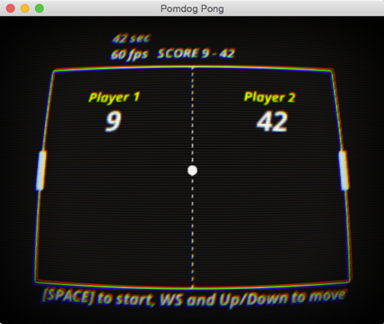

# Pong



## Prerequisites

#### Runtime requirements

* Mac OS X 10.9+
* Windows 8+
* OpenGL 4, DirectX 11 or DirectX 12

#### Build requirements

* Python 2.7
* Xcode 6.3 and later
* Visual Studio 2015 and later

#### Pulling all dependencies using Git

Make sure git is installed.
From the root of your project directory, run:

```shell
cd Pong
git clone --depth=1 https://github.com/mogemimi/pomdog.git ThirdParty/pomdog
git clone --depth=1 https://github.com/mogemimi/pomdog-third-party.git ThirdParty/pomdog/third-party
git clone --depth=1 https://chromium.googlesource.com/external/gyp.git Tools/gyp
```

## How to build

### Building under Mac OS X and Xcode

**1. Generating the Xcode project file**

```shell
python Tools/gyp/gyp_main.py Pong.gyp --depth=. -f xcode --generator-output=Build.xcodefiles
```

You can also use `gyp` instead of `python Tools/gyp/gyp_main.py`:

```shell
gyp Pong.gyp --depth=. -f xcode --generator-output=Build.xcodefiles
```

For information on how to install gyp, please see [How to Install GYP](https://github.com/mogemimi/pomdog/wiki/How-to-Install-GYP) on the GitHub wiki.

**2. Building (Release/Debug)**

```shell
xcodebuild -project Build.xcodefiles/Pong.xcodeproj
```

To build in release mode, use `-configuration` option:

```shell
xcodebuild -project Build.xcodefiles/Pong.xcodeproj -configuration Release
```

**3. Running app**

```shell
open build/Release/Pong.app
```

### Building under Visual Studio 2015

Generate the Visual Studio project files:

**PowerShell**

```powershell
python Tools/gyp/gyp_main.py Pong.gyp --depth=. -f msvs `
    -G msvs_version=2015 --generator-output=Build.msvs
```

**Git Bash (MinGW)**

```shell
python Tools/gyp/gyp_main.py Pong.gyp --depth=. -f msvs \
    -G msvs_version=2015 --generator-output=Build.msvs
```

Open `Build.msvs/Pong.sln` in Visual Studio and build your app.
To run your app, change Pong project property to the following
at `Configuration Properties > Debugging > Working Directory` in Visual Studio:

|||
|:----|:----|
|Working Directory|`$(ProjectDir)..`|
