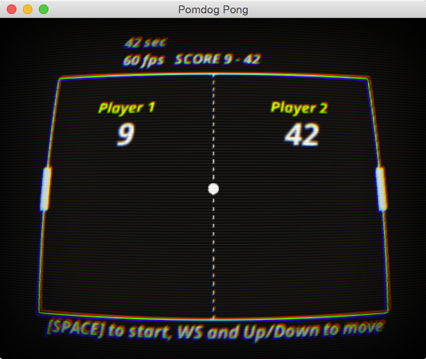

# pong



## How to build

### Building under Linux

```sh
cd path/to/pong

# Generate Ninja file to the 'build' directory
cmake -Bbuild -H. -G Ninja \
    -DCMAKE_C_COMPILER=clang \
    -DCMAKE_CXX_COMPILER=clang++ \
    -DCMAKE_CXX_FLAGS="-stdlib=libc++" \
    -DCMAKE_EXE_LINKER_FLAGS="-stdlib=libc++ -lc++abi" \
    -DCMAKE_BUILD_TYPE=Debug

# Building application
ninja -C build

# To run your application, you can use the following
./build/pong
```

To build in release mode, use `-DCMAKE_BUILD_TYPE` option:

```sh
cmake -DCMAKE_BUILD_TYPE=Release ..
```

### Building under Mac and Xcode

```sh
cd path/to/pong

# Generate Xcode project files to the 'build' directory
cmake -Bbuild -H. -G Xcode -DCMAKE_XCODE_GENERATE_SCHEME=ON

# Compiling source code
xcodebuild -project build/pong.xcodeproj -configuration Debug

# To run your application, you can use the following
open build/Debug/pong.app
```

To build in release mode, use `-configuration` option:

```sh
xcodebuild -project build/pong.xcodeproj -configuration Release
```

To develop your application on Xcode, please open `pong.xcodeproj` in Xcode.

### Building under Visual Studio 2022

```sh
# Git Bash (MinGW)
cd path/to/pong

# Generate projects for Visual Studio 2022 to the 'build' directory
cmake -Bbuild -H. -G "Visual Studio 17"

# Building projects using CMake and MSBuild
cmake --build build --config Debug

# To run your application, you can use the following
./build/Debug/pong
```

To build in release mode, use `--config` option:

```sh
cmake --build build --config Release
```

To develop your application on Visual Studio, please open `pong.sln` in Visual Studio.
